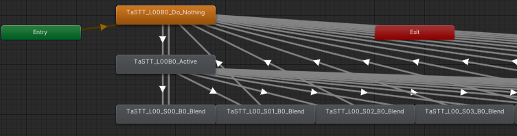
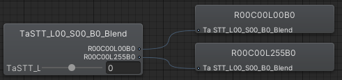

## TaSTT: A deliciously free STT

TaSTT (pronounced "tasty") is a free speech-to-text tool for VRChat. It uses
[a GPU-based transcription algorithm](https://github.com/openai/whisper) to
turn your voice into text, then sends it into VRChat via OSC.

To get started, download the latest .zip from [the releases page](https://github.com/yum-food/TaSTT/releases/latest).

[](https://youtube.com/watch?v=u5h-ivkwS0M)

Contents:

0. [Usage and setup](#usage-and-setup)
1. [Features](#features)
2. [Requirements](#requirements)
3. [Motivation](#motivation)
4. [Design overview](#design-overview)
5. [Contributing](#contributing)
6. [Backlog](#backlog)

Made with love by yum\_food.

## Usage and setup

Download the latest .zip from [the releases page](https://github.com/yum-food/TaSTT/releases/latest).

Please [join the discord](https://discord.gg/YWmCvbCRyn) to share feedback and
get technical help.

To build your own package from source, see GUI/README.md.

Basic controls:
* Short click to toggle transcription.
* Long click to hide the text box.
* Scale it up/down in the radial menu.

## Features

* Customizable board resolution, [up to ridiculous sizes](https://www.youtube.com/watch?v=u5h-ivkwS0M).
* Lighweight design:
  * Custom textbox requires as few as 65 parameter bits
  * Transcription doesn't affect VRChat framerate much, since VRC is heavily
    CPU-bound. Performance impact when not speaking is negligible.
* Multi-language support.
  * Japanese, Korean, and Chinese glyphs included, among many other languages.
  * Whisper natively supports transcription in [100 languages](
    https://github.com/openai/whisper/blob/main/whisper/tokenizer.py#L10).
* Customizable:
  * Control button may be set to left/right a/b/joystick.
  * Text color, background color, and border color are customizable in the shader.
  * Text background may be customized with PBR textures: base color, normal,
    metallic, roughness, and emission are all implemented.
  * Border width and rounding are customizable.
  * Shader supports physically based shading: smoothness, metallic, and emissive.
* Works with the built-in chatbox (usable with public avatars!)
* Many optional quality-of-life features:
  * Audio feedback: hear distinct beeps when transcription starts and stops.
  * May also enable in-game noise indicator, to grab others' attention.
  * Visual transcription indicator.
  * Resize with a blendtree in your radial menu.
* Locks to world space when done speaking.
* Privacy-respecting: transcription is done on your GPU, not in the cloud.
* Hackable.
* From-scratch implementation.
* Free as in beer.
* Free as in freedom.
* MIT license.

## Requirements

* ~8GB disk space
  * I apologize that this is so big. The libraries used to perform
    GPU-accelerated transcription (pytorch and whisper) are really,
    really big. There is no performant implementation of Whisper or a
    any other comparable algorithm available in a systems programming
    language, so for now we're stuck with this. You only need to
    download this stuff once!
* NVIDIA GPU with at least 2GB of spare VRAM.
  * You *can* run it in CPU mode, but it's really slow and lags you a
    lot more, so I wouldn't recommend it.
  * I've tested on a 1080 Ti and a 3090 and saw comparable performance.
* SteamVR.
  * No Oculus support, yet.
* Left joystick click must not be bound to anything else.
* No write defaults on your avatar if you're using the custom text box.

For the last 3 bullets: please let me know in the Discord if these are
deal breakers. I'd be happy to fix them!

## Motivation

Many VRChat players choose not to use their mics, but as a practical matter,
occasionally have to communicate. I want this to be as simple, efficient, and
reliable as possible.

There are existing tools which help here, but they are all imperfect for one
reason or another:

1. RabidCrab's STT costs money and relies on cloud-based transcription. I have
   struggled with latency, quality, and reliability issues. It's also
   closed-source.
2. The in-game text box is not visible in streamer mode, and limits you to one
   update every ~2 seconds, making it a poor choice for latency-sensitive
   communication.
3. [KillFrenzy's AvatarText](https://github.com/killfrenzy96/KillFrenzyAvatarText)
   only supports text-to-text, and is GPL, making it legally risky for people
   who want to sell closed-source software.
4. [I5UCC's VRCTextboxSTT](https://github.com/I5UCC/VRCTextboxSTT) makes
   KillFrenzy's AvatarText and Whisper kiss. It's the closest spiritual cousin
   to this repository. There are two crucial differences: it's GPL not MIT, and
   it doesn't abstract away the command line.

## Design overview

These are the important bits:

1. `TaSTT_template.shader`. A simple unlit shader template. Contains the
   business logic for the shader that shows text in game.
2. `generate_shader.py`. Adds parameters and an accessor function to the
   shader template.
3. `libunity.py`. Contains the logic required to generate and manipulate Unity
   YAML files. Works well enough on YAMLs up to ~40k documents, 1M lines.
4. `libtastt.py`. Contains the logic to generate TaSTT-specific Unity files,
   namely the animations and the animator.
5. `osc_ctrl.py`. Sends OSC messages to VRChat, which it dutifully passes along
   to the generated FX layer.
6. `transcribe.py`. Uses OpenAI's whisper neural network to transcribe audio
   and sends it to the board using osc_ctrl.

#### Parameters & board indexing

I divide the board into several regions and use a single int parameter,
`TaSTT_Select`, to select the active region. For each byte of data
in the active region, I use a float parameter to blend between two
animations: one with value 0, and one with value 255.

To support wide character sets, I support 2 bytes per character. This
can be configured down to 1 byte per character to save parameter bits.

#### FX controller design

The FX controller (AKA animator) is pretty simple. There is one layer for each
sync parameter (i.e. each character byte). The layer has to work out which
region it's in, then write a byte to the correct shader parameter.



From top down, we first check if updating the board is enabled. If no, we stay
in the first state. Then we check which cell we're in. Finally, we drive a
shader parameter to one of 256 possible values using a blendtree.



The blendtree trick lets us represent wide character sets efficiently. The
number of animations required increases logarithmically with the size of the
character set:

```
(N bytes per character) = ceil(log2(size of character set))
(total animations) =
    (2 animations per byte) *
    (N bytes per character) *
    (M chars per cell)
```

## Contributing

Contributions welcome. Send a pull request to this repository.

See GUI/README.md for instructions on building the GUI.

Ping the discord if you need help getting set up.

## Backlog

1. Better Unity integrations
   1. Port all scripts to Unity-native C# scripts.
   2. ~~Support appending to existing FX layers.~~ DONE
   3. Use VRCSDK to generate FX layer instead of generating the serialized files.
2. In-game usability features.
   1. ~~Resizing (talk to friends far away).~~ DONE
   2. ~~Basic toggles (hide it when not needed).~~ DONE
   3. ~~World mounting (leave it in a fixed position in world space).~~ DONE
   4. ~~Avatar mounting (attach it to your hand)~~ DONE.
   5. ~~Controller triggers (avoid having to use the radial menu every time you
     want to speak).~~ DONE
3. General usability features.
   1. ~~Error detection & correction.~~ DONE
   2. ~~Text-to-text interface. Type in terminal, show in game.~~ DONE
   3. ~~Speech-to-text interface. Speak out loud, show in game.~~ DONE
   4. Translation into non-English. Whisper natively supports translating N
      languages into English, but not the other way around.
   5. Display text in overlay. Enables (1) lower latency view of TaSTT's
      transcription state; (2) checking transcriptions ahead of time; (3)
      checking transcriptions without having to see the board in game.
   6. TTS. Multiple people have requested this. See if there are open source
      algorithms available; or, figure out how to integrate with
   7. ~~Save UI input fields to config file. Persist across process exit. It's
      annoying having to re-enter the config every time I use the STT.~~ DONE
   8. ~~Customizable controller bindings. Someone mentioned they use left click
      to unmute. Let's work around users, not make them change their existing
      keybinds.~~ DONE
4. Optimization
   1. ~~Utilize the avatar 3.0 SDK's ability to drive parameters to reduce the
     total # of parameters (and therefore OSC messages & sync events). Note
     that the parameter memory usage may not decrease.~~ DONE
   2. ~~Optimize FX layer. We have 14k animations and a 1.2 million line FX
      layer. Something must be rethought to bring these numbers down.~~ DONE
   3. ~~Implement multicore YAML parsing. This will make working with large
      animators much more practical.~~ DONE
   4. ~~Transcription engine sleep interval increases exponentially up to 1-2
      seconds, then jumps back to a short interval once speech is detected.
      This should significantly cut down on idle resource consumption. Perhaps
      there's even a more efficient way to detect the odds that anything is
      being said, which we could use to gate transcription.~~ DONE
   5. There are ~64k words in the English language. We could encode each word
      using a 16-bit int. On the other hand, suppose you represented each
      character using 7 bits per character and transmitted words
      character-by-character. The average word length is 4.7 characters, and we
      send ~1 space character per word. Thus the expected bits per word in an
      optimized version of today's encoding scheme is (5.7 * 7) == 39.9 bits.
      The other encoding scheme is thus ~2.5 times more efficient. This could
      be used to significantly speed up sync times. (Thanks, Noppers for the
      idea!)
5. Bugfixes
   1. ~~The whisper STT says "Thank you." when there's no audio?~~ DONE
   2. JP and CN transcription does not work in the GUI due to encoding issues.
6. Shine
   1. Smooth scrolling.
   2. ~~Infinite scrolling.~~ DONE
   3. ~~Sound indicator, maybe like animal crossing :)~~ DONE
   4. Support texture-based PBR shading

