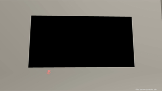

## TaSTT: A deliciously free STT

TaSTT (pronounced "tasty") is a free speech-to-text tool for VRChat. It uses
local machine translation to turn your voice into text, then sends it into
VRChat via OSC. A few parameters, a machine-generated FX layer, and a
custom shader display the text in game.



Features:
* 4x44 grid, 256 or 65536 characters per slot.
* Text-to-text interface.
* Speech-to-text interface.
* Free as in beer.
* Free as in freedom.
* Privacy-respecting: transcription is done on your GPU, not in the cloud.
* Hackable.
* 100% from-scratch implementation.
* Permissive MIT license.

Contents:
1. [Motivation](#motivation)
2. [Design overview](#design-overview)
3. [Contributing](#contributing)
4. [Backlog](#backlog)

Made with love by yum\_food.

### Motivation

Many VRChat players choose not to use their mics, but as a practical matter,
occasionally have to communicate. I want this to be as simple, efficient, and
reliable as possible.

There are existing tools which help here, but they are all imperfect for one
reason or another:

1. RabidCrab's STT costs money and relies on cloud-based translation. I have
   struggled with latency, quality, and reliability issues. It's also
   closed-source.
2. The in-game text box is only visible to your friends list, making it
   useless for those who like to make new friends.

Thus I believe that a free alternative is both needed and justified.

I hope that this codebase aids and motivates the creation of better, more
expressive communication tools for mutes.

### Design overview

There are currently 5 important pieces:

1. `TaSTT.shader`. A simple unlit shader. Has one parameter per cell in the
   display.
2. `libunity.py`. Contains the logic required to generate and manipulate Unity
   YAML files. Works well enough on YAMLs up to ~40k documents, 1M lines.
3. `libtastt.py`. Contains the logic to generate TaSTT-specific Unity files,
   namely the animations and the animator.
4. `osc_ctrl.py`. Sends OSC messages to VRChat, which it dutifully passes along
   to the generated FX layer.
5. `transcribe.py`. Uses OpenAI's whisper neural network to transcribe audio
   and sends it to the board using osc_ctrl.

#### Parameters & board indexing

I divide the board into 16 regions and use a single int parameter,
`TaSTT_Select`, to select the active region. For each byte of data
in the active region, I use a float parameter to blend between two
animations: one with value 0, and one with value 255.

To support wide character sets, I support 2 bytes per character. This
can be configured down to 1 byte per character to save parameter bits.

The the total amount of parameter memory used is dictated by this equation:

```
ROWS = 4
COLS = 44
CELLS = 16
MEMORY = ROWS * COLS * (N bits per character) / CELLS + 1 + log2(CELLS)
```

This is currently 93 bits for 1-byte characters and 181 bits for 2-byte
characters.

#### FX controller design

The FX controller (AKA animator) is pretty simple. There is one layer for each
character in a cell. The layer has to work out which cell it's in, then
work out which letter we want to write in that cell, then run an animation for
that letter.


From top down, we first check if updating the board is enabled. If no, we stay
in the first state. Then we check which cell we're in. Finally, we drive a
shader parameter to one of 256 possible values using a blendtree.


The blendtree trick lets us represent wide character sets efficiently. The
number of animations required increases logarithmically with the size of the
character set:

```
(N bytes per character) = ceil(log2(size of character set))
(total animations) =
    (2 animations per byte) *
    (N bytes per character) *
    (M chars per cell)
```

### Contributing

Contributions welcome. Send a pull request to this repository.

To use the STT:

1. Enable Windows Subsystem for Linux. This is a lightweight Linux virtual
   machine that runs on your Windows host. You can access the Windows
   filesystem at /mnt/c/....
2. `$ cd /mnt/c/path/to/your/unity/project`
2. `$ cd Assets`
3. `$ git clone https://github.com/yum\_food/TaSTT`
4. `$ cd TaSTT`
5. `$ ./generate.sh`
6. Put TaSTT\_fx.controller and TaSTT\_params.asset on your avatar.
7. Upload (or build & test).
8. Open powershell.
9. Navigate to TaSTT.
10. `$ python3 ./osc_ctrl.py`
11. Start typing. Your messages should show display in-game.

### Backlog

1. Better Unity integrations
   1. Port all scripts to Unity-native C# scripts.
   2. ~~Support appending to existing FX layers.~~ DONE
   3. Use VRCSDK to generate FX layer instead of generating the serialized files.
2. In-game usability features.
   1. Resizing (talk to friends far away).
   2. ~~Basic toggles (hide it when not needed).~~ DONE
   3. ~~World mounting (leave it in a fixed position in world space).~~ DONE
   4. Avatar mounting (attach it to your hand).
   5. Controller triggers (avoid having to use the radial menu every time you
     want to speak).
3. General usability features.
   1. Error detection & correction.
   2. ~~Text-to-text interface. Type in terminal, show in game.~~ DONE
   3. ~~Speech-to-text interface. Speak out loud, show in game.~~ DONE
4. Optimization
   1. ~~Utilize the avatar 3.0 SDK's ability to drive parameters to reduce the
     total # of parameters (and therefore OSC messages & sync events). Note
     that the parameter memory usage may not decrease.~~ DONE
   2. ~~Optimize FX layer. We have 14k animations and a 1.2 million line FX
      layer. Something must be rethought to bring these numbers down.~~ DONE
   3. ~~Implement multicore YAML parsing. This will make working with large
      animators much more practical.~~ DONE
   4. ~~Transcription engine sleep interval increases exponentially up to 1-2
      seconds, then jumps back to a short interval once speech is detected.
      This should significantly cut down on idle resource consumption. Perhaps
      there's even a more efficient way to detect the odds that anything is
      being said, which we could use to gate transcription.~~ DONE
5. Bugfixes
   1. ~~The whisper STT says "Thank you." when there's no audio?~~ DONE
6. Shine
   1. Smooth scrolling.
   2. ~~Infinite scrolling.~~ DONE
   3. ~~Sound indicator, maybe like animal crossing :)~~ DONE

