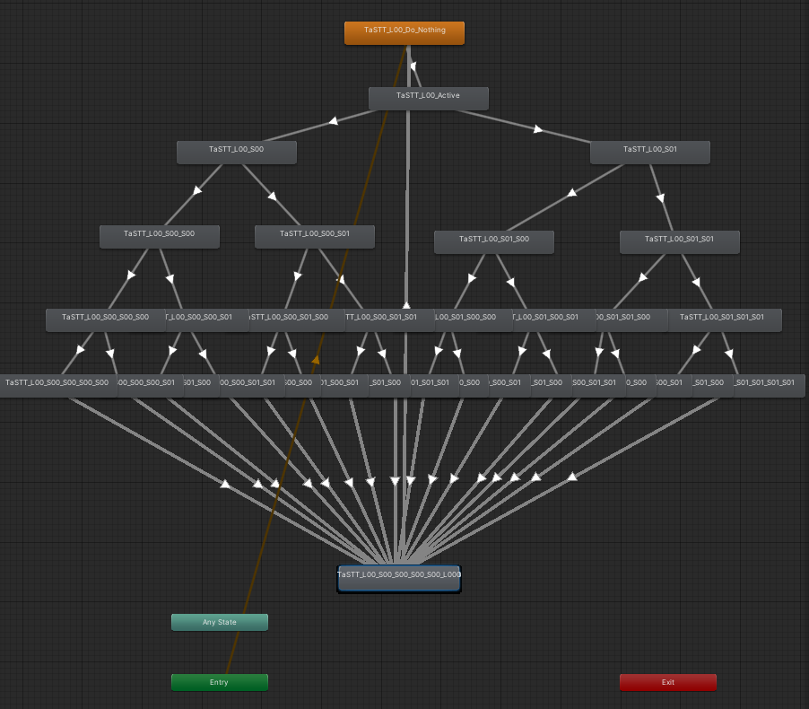

## TaSTT: A deliciously free STT

TaSTT (pronounced "tasty") is a free speech-to-text tool for VRChat. It uses
local machine translation to turn your voice into text, then sends it into
VRChat via OSC. A few parameters, a machine-generated FX layer, and a
custom shader display the text in game.


Features:
* 8x22 display grid, 80 characters per slot.
* Text-to-text interface.
* Speech-to-text interface.
* Free as in beer.
* Free as in freedom.
* Privacy-respecting: transcription is done on your GPU, not in the cloud.
* Hackable.
* 100% from-scratch implementation.
* Permissive MIT license.

Contents:
1. [Motivation](#motivation)
2. [Design overview](#design-overview)
3. [Contributing](#contributing)
4. [Backlog](#backlog)

Made with love by yum\_food.

### Motivation

Many VRChat players choose not to use their mics, but as a practical matter,
occasionally have to communicate. I want this to be as simple, efficient, and
reliable as possible.

There are existing tools which help here, but they are all imperfect for one
reason or another:

1. RabidCrab's STT costs money and relies on cloud-based translation. I have
   struggled with latency, quality, and reliability issues. It's also
   closed-source.
2. The in-game text box is only visible to your friends list, making it
   useless for those who like to make new friends.

Thus I believe that a free alternative is both needed and justified.

I hope that this codebase aids and motivates the creation of better, more
expressive communication tools for mutes.

### Design overview

There are currently 5 important pieces:

1. `TaSTT.shader`. A simple unlit shader. Has one parameter per cell in the
   display.
2. `generate_animations.sh`. Generates one animation per (row, column, letter).
   These animations allow us to write the shader's parameters from an FX layer.
3. `generate_fx.py`. Generates a colossal FX layer which maps (row, column,
   letter, active) to exactly one of TaSTT.shader's parameters.
4. `osc_ctrl.py`. Sends OSC messages to VRChat, which it dutifully passes along
   to the generated FX layer.
5. `transcribe.py`. Uses OpenAI's whisper neural network to transcribe audio
   and sends it to the board using osc_ctrl.

#### Parameters & board indexing

There are 2 obvious ways to tell the board how to display a message:

1. Independently parameterize every character slot. If we want to display
   a 140-character tweet, this means using (140 characters) * (8 bits
   per character) == 1120 bits of parameter memory. VRChat only gives us 256!
2. Parameterize one character slot. We could have an 8-bit letter, an 8-bit row
   select, and an 8-bit column select. To avoid overwriting cells while we seek,
   we could include a 1-bit enable. This approach works, and uses very few
   parameter bits, but it requires us to update the same parameter very quickly.
   Experimental results with this were not promising; remote viewers would see
   the wrong letters pretty often.

Thus I settled on a hybrid approach: we divide the board into `cells`,
inside of which we can independently address each character slot. There
are currently 16 cells.

Since the board has (22 columns) * (8 rows) == 176 character slots, each cell
contains (176 characters) / (16 cells) = 11 characters.

To update a cell, we do this for every single character:

1. Select the cell. Since there are 16 cells, this requires 4 bits.
2. Select the letter. Since we support 256 letters per cell, this requires 8 bits.

To avoid overwriting cells while we seek around, we also have a single boolean
which enables/disables updating any cells.

Thus the total amount of parameter memory used is dictated by this equation:

```
ROWS * COLS * (log2(CELLS) + 8) / CELLS + 1
```

This is currently 133 bits.

#### FX controller design

The FX controller (AKA animator) is pretty simple. There is one layer for each
character in a cell. Thus the layer has to work out which cell it's in, then
work out which letter we want to write in that cell, then run an animation for
that letter.

Here's a layer where I manually moved things around to show the structure of
the decision tree:



From top down, we first check if updating the board is enabled. If no, we stay
in the first state. Then we check which cell we're in. This is divided into 4
binary checks, each looking at a boolean parameter. Finally, we fire one of 80
animations based on the value of the current layer's Letter parameter.

In the pictured FX layer, there are 16 cells each controlling 80 animations,
for a total of 1280 animations. There are 11 such layers.

### Contributing

Contributions welcome. Send a pull request to this repository.

To use the STT:

1. Enable Windows Subsystem for Linux. This is a lightweight Linux virtual
   machine that runs on your Windows host. You can access the Windows
   filesystem at /mnt/c/....
2. `$ cd /mnt/c/path/to/your/unity/project`
2. `$ cd Assets`
3. `$ git clone https://github.com/yum\_food/TaSTT`
4. `$ cd TaSTT`
5. `$ ./generate.sh`
6. Put TaSTT\_fx.controller and TaSTT\_params.asset on your avatar.
7. Upload (or build & test).
8. Open powershell.
9. Navigate to TaSTT.
10. `$ python3 ./osc_ctrl.py`
11. Start typing. Your messages should show display in-game.

### Backlog

1. Better Unity integrations
   1. Port all scripts to Unity-native C# scripts.
   2. Support appending to existing FX layers.
   3. Use VRCSDK to generate FX layer instead of generating the serialized files.
2. In-game usability features.
   1. Resizing (talk to friends far away).
   2. Basic toggles (hide it when not needed).
   3. World mounting (leave it in a fixed position in world space).
   4. Avatar mounting (attach it to your hand).
   5. Controller triggers (avoid having to use the radial menu every time you
     want to speak).
3. General usability features.
   1. Error detection & correction.
   2. ~~Text-to-text interface. Type in terminal, show in game.~~ DONE
   3. ~~Speech-to-text interface. Speak out loud, show in game.~~ DONE
4. Optimization
   1. Utilize the avatar 3.0 SDK's ability to drive parameters to reduce the
     total # of parameters (and therefore OSC messages & sync events). Note
     that the parameter memory usage may not decrease.
   2. Optimize FX layer. We have 14k animations and a 1.2 million line FX
      layer. Something must be rethought to bring these numbers down.
   3. Implement multicore YAML parsing. This will make working with large
      animators much more practical.
5. Bugfixes
   1. The whisper STT says "Thank you." when there's no audio?
6. Shine
   1. Smooth scrolling.
   2. Infinite scrolling.
   3. Sound indicator, maybe like animal crossing :)

